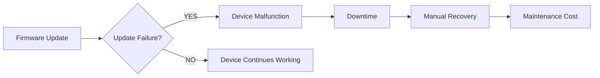
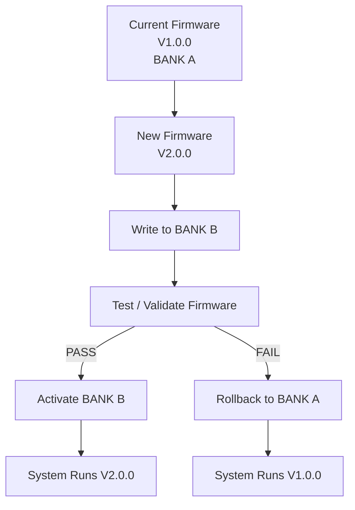
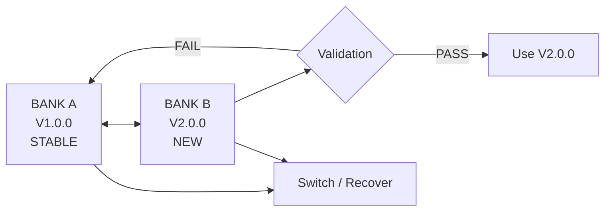
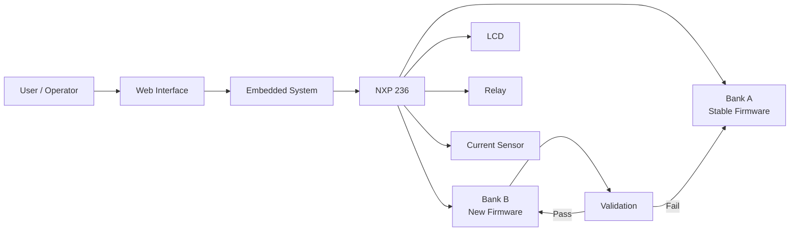
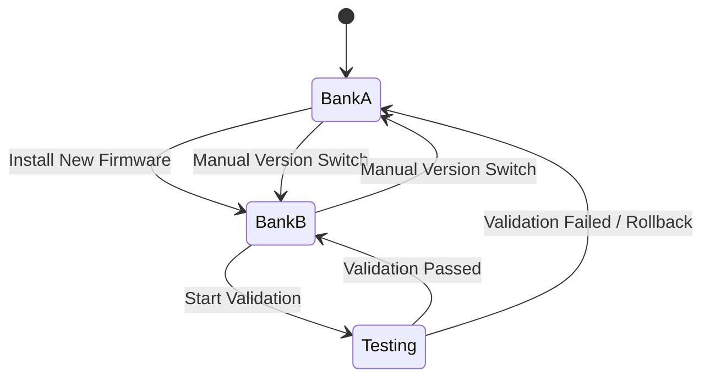

# 🔐 Secure OTA Guardian

### Safe Firmware Updates Without Risking the Working System

**Secure OTA Guardian** is an embedded firmware-update system designed for devices where a failed firmware update can cause downtime or make the device unusable.

The system uses a **dual-bank firmware architecture** on an **NXP 236** platform.

Instead of overwriting the currently working firmware, the new firmware is installed into a separate bank, tested, and activated only if it passes validation.

---

## 🎯 Problem

Firmware updates are necessary for modern embedded devices, but updating firmware directly can be risky.

A failed update can lead to:

* ❌ Device malfunction
* ❌ Unexpected downtime
* ❌ Difficult recovery
* ❌ Maintenance cost

This is especially important for devices such as:

**EV Chargers • Medical Equipment • Industrial Controllers • Smart Appliances**

### Problem Analysis

---

# 💡 Our Solution

## Secure OTA Guardian

The core idea is simple:

> **Never risk the working firmware while installing a new firmware version.**

The system maintains two firmware banks:

* **Bank A** → Current stable firmware
* **Bank B** → New firmware

The new firmware is tested before becoming active.

---

# ⚙️ How It Works

### Simple Flow

**New Firmware → Bank B → Test → Pass / Fail**

✅ Pass → **Activate Bank B**

❌ Fail → **Rollback to Bank A**

---

# 🔄 Dual-Bank Architecture

The dual-bank design also allows switching between available firmware versions when required.

---

# 🧩 MVP Hardware

| Component               | Purpose                        |
| ----------------------- | ------------------------------ |
| **NXP 236**             | Main embedded controller       |
| **Dual Firmware Banks** | Store current and new firmware |
| **LCD Display**         | Display system/update status   |
| **Relay Module**        | Control connected load         |
| **Current Sensor**      | Monitor current                |
| **Other peripherals**   | Support system operation       |

---

# 🖥️ Software

The project also includes a web/software interface for interacting with and monitoring the system.

🌐 **Live Website:**
https://guardian-x.vercel.app

---

# 🚀 Key Features

* 🔄 Dual-bank firmware storage
* 🛡️ Safe firmware validation
* ↩️ Automatic rollback on failure
* 🔀 Firmware version switching
* 📟 LCD-based status display
* ⚡ Current/load monitoring
* 🌐 Web-based interface

> Features shown here should match the currently implemented prototype.

---

# 🏗️ System Architecture

---

# 🔁 Firmware Update Logic

---

# 🌍 Potential Applications

Secure OTA Guardian can be adapted for embedded devices where firmware failure may cause operational problems.

### Possible applications

* ⚡ EV Charging Systems
* 🏥 Medical / Surgical Equipment
* 🏭 Industrial Controllers
* 🏠 Smart Appliances
* 🔌 Connected Embedded Devices

---

# 🔮 Future Scope

The current MVP can be extended with:

* Secure remote OTA updates
* Digital signature verification
* Anti-downgrade protection
* Cloud-based device monitoring
* Fleet management
* Staged / canary deployment
* Automated alerts
* Advanced device health monitoring

---

## 🌐 Project

**Live Website:**
https://guardian-x.vercel.app

---

### 💬 Core Idea

> **Update the firmware. Test it safely. Roll back when necessary. Keep the device running.**

**Secure OTA Guardian — Update without risking the working firmware.**
